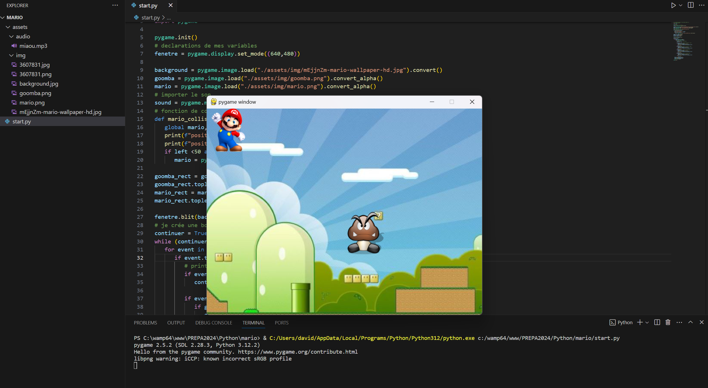

# pygame project for educative python learning (Theme Mario)

- how to use def
- condition
- scope and global vars
- while


## Deployment

To use pygame library

```bash
  pip install pygame
```


## Screenshots



